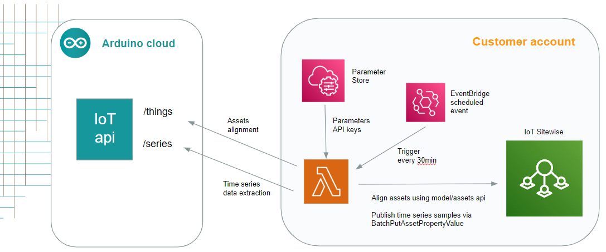
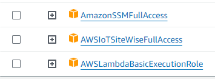
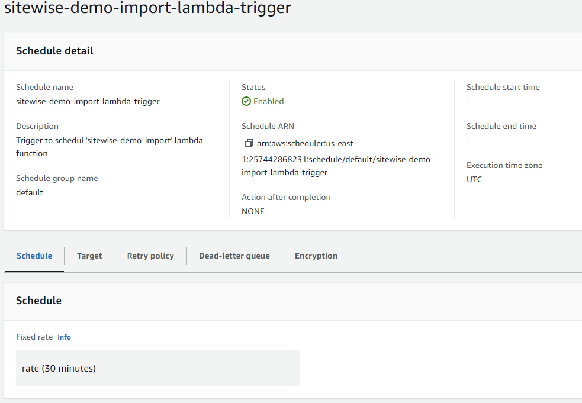

# AWS IoT SiteWise imported

This project provides a way to extract time series samples from Arduino cloud, publishing into AWS IoT SiteWise.
Other than publishing ts samples, job is able to create Models/Assets into SiteWise starting from Arduino defined Things.
Things can be filterd by tags.

## Deployment schema



Imported is based on a Go lambda function triggered by periodic events from EventBridge.
Job is configured to extract samples for a 30min time window, so scheduled triggers must be configured accordingly.

### Policies

Lamba requires following policies:



### Configuration parameters

| Parameter | Description |
| --------- | ----------- |
| /sitewise-importer/iot/api-key  | IoT API key |
| /sitewise-importer/iot/api-secret | IoT API secret |
| /sitewise-importer/iot/org-id    | (optiona) organization id |
| /sitewise-importer/iot/filter/tags    | (optional) tags filtering. Syntax: tag=value,tag2=value2   |

## Deployment steps

Required steps to deploy project:
* create a new role for lamba function. See above for required policies.
* compile lambda
```console
foo@bar:~$ ./compile-lambda.sh
Create sitewise-aligner.zip archive
```
* Create a new lambda function based on Amazon Linux (suitable to execute golang code). As code, use sitewise-aligner.zip file created by above script.
* Create SSM parameters described above and configure them properly
* Create a new scheduled event from EventBridge
  


## Import historical data with a batch job

For more info, see [import batch](resources/job/README.md)

