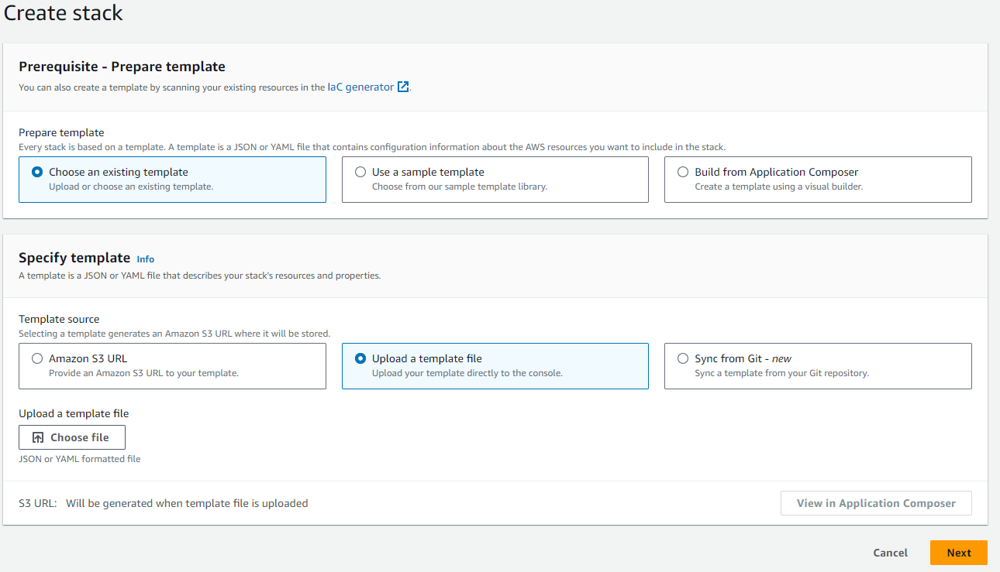
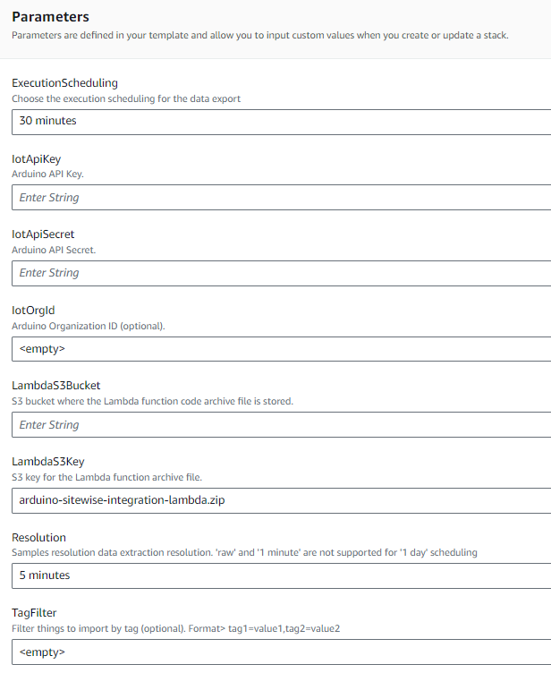

# AWS IoT SiteWise importer

This project provides a way to extract time series samples from Arduino cloud, publishing into AWS IoT SiteWise.
Other than publishing ts samples, job is able to create Models/Assets into SiteWise starting from Arduino defined Things.
Things can be filterd by tags.

## Architecture

Imported is based on a Go lambda function triggered by periodic events from EventBridge.
Job is configured to extract samples every 30 minutes. By default, data are aggregated at 5 minute resolution (as AVG).

## Deployment via Cloud Formation Template

It is possible to deploy required resources via [cloud formation template](deployment/cloud-formation-template/deployment.yaml)

AWS user must have permissions to:
  * create a new CFT stack (policy: AWSCloudFormationFullAccess)
  * S3 buckets (policy: AmazonS3FullAccess)
  * IAM Roles (policy: IAMFullAccess)
  * Lambda functions (policy: AWSLambda_FullAccess)
  * EventBridge rules (policy: AmazonEventBridgeFullAccess)
  * SSM parameters (Parameter store) (policy: AmazonSSMFullAccess)

To see runtime required permissions, see policies defined in [cloud formation template](deployment/cloud-formation-template/deployment.yaml)

Before creating a stack, it is required to create a temporary S3 bucket where storing lambda binaries.

Follow these steps to deploy a new stack:
* download [lambda code binaries](https://github.com/arduino/aws-sitewise-integration/releases) and [Cloud Formation Template](deployment/cloud-formation-template/deployment.yaml)
* upload CFT and binary zip file on an S3 bucket accessible by the AWS account. For the CFT yaml file, copy the Object URL (it will be required in next step).

* start creation of a new cloud formation stack

* fill all required parameters.
   **Mandatory**: Arduino API key and secret, S3 bucket where code has been uploaded
   **Optional**: tag filter for filtering things, organization identifier and samples resolution

### Configuration parameters

| Parameter | Description |
| --------- | ----------- |
| /arduino/sitewise-importer/{stack-name}/iot/api-key  | IoT API key |
| /arduino/sitewise-importer/{stack-name}/iot/api-secret | IoT API secret |
| /arduino/sitewise-importer/{stack-name}/iot/org-id    | (optional) organization id |
| /arduino/sitewise-importer/{stack-name}/iot/filter/tags    | (optional) tags filtering. Syntax: tag=value,tag2=value2  |
| /arduino/sitewise-importer/{stack-name}/iot/samples-resolution  | (optional) samples resolution (default: 5 minutes) |
| /arduino/sitewise-importer/{stack-name}/iot/scheduling  | function scheduling |

## Import historical data with a batch job

For more info, see [import batch](resources/job/README.md)

